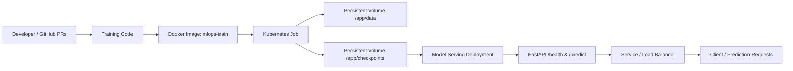

# MLOps PyTorch Pipeline

A production-style MLOps pipeline for training and serving a CIFAR-10 image classifier using PyTorch, Docker, and Kubernetes.

## Overview

This project demonstrates a simple end-to-end ML workflow:

- Train a ResNet-18 model on CIFAR-10
- Save the best model checkpoint to a mounted storage path
- Serve the trained model via a FastAPI + Uvicorn API
- Package training and serving workloads in Docker containers
- Deploy the application on Kubernetes using a Namespace, ConfigMap, Job, Deployment, Service, and HPA

## Architecture Diagram



## Repository Structure

```text
mlops-pytorch-pipeline/
├── configs/
│   └── training_config.yaml
├── data/
│   └── cifar-10-batches-py/
├── docker/
│   ├── Dockerfile.train
│   └── Dockerfile.serve
├── k8s/
│   ├── namespace.yaml
│   ├── configmap.yaml
│   ├── training-job.yaml
│   ├── serving-deployment.yaml
│   ├── serving-service.yaml
│   ├── hpa.yaml
│   └── README.md
├── requirements/
│   ├── train.txt
│   └── serve.txt
├── src/
│   ├── dataset.py
│   ├── model.py
│   ├── serve.py
│   └── train.py
├── tests/
│   └── test_model.py
├── checkpoints/
├── docker logs.txt
├── MLOPS_Assignment3.code-workspace
└── README.md
```

## Prerequisites

Before running the project, make sure you have:

- Python 3.11+
- pip
- Docker
- kubectl
- A running Kubernetes cluster (or local Kubernetes environment)
- NVIDIA GPU support if you want to run GPU-enabled training jobs

## Local Setup

### 1. Clone the repository

```bash
git clone https://github.com/SriDA25M530/mlops-pytorch-pipeline.git
cd mlops-pytorch-pipeline
```

### 2. Create a virtual environment

```bash
python -m venv .venv
source .venv/bin/activate
```

On Windows PowerShell:

```powershell
python -m venv .venv
.\.venv\Scripts\Activate.ps1
```

### 3. Install dependencies

```bash
pip install -r requirements/train.txt
pip install -r requirements/serve.txt
```

## Training Workflow

The training job loads configuration from `/app/configs/training_config.yaml` in Docker/Kubernetes and from `configs/training_config.yaml` locally.

### Run training locally

```bash
python src/train.py
```

This will:

- load CIFAR-10 data from the configured directory
- train a ResNet-18 classifier
- evaluate on validation data
- save the best checkpoint to `/app/checkpoints/classifier_v1.pt`

## Serving Workflow

The serving API loads the saved model checkpoint and exposes the inference endpoints.

### Run the API locally

```bash
uvicorn src.serve:app --host 0.0.0.0 --port 8080
```

#### Endpoints

- `GET /health` — checks whether the model is loaded and healthy
- `POST /predict` — uploads an image and returns class probabilities

### Example prediction request

```bash
curl -X POST http://localhost:8080/predict \
  -F "image=@test_image.png"
```

## Docker Build

### Build training image

```bash
docker build -f docker/Dockerfile.train -t mlops-train:v1 .
```

### Build serving image

```bash
docker build -f docker/Dockerfile.serve -t mlops-serve:v1 .
```

## Kubernetes Deployment

The project contains Kubernetes manifests under the `k8s/` directory.

### Apply namespace and config

```bash
kubectl apply -f k8s/namespace.yaml
kubectl apply -f k8s/configmap.yaml
```

### Run the training job

```bash
kubectl apply -f k8s/training-job.yaml
```

### Deploy the model serving app

```bash
kubectl apply -f k8s/serving-deployment.yaml
kubectl apply -f k8s/serving-service.yaml
kubectl apply -f k8s/hpa.yaml
```

### Verify pods

```bash
kubectl get pods -n ml-training
kubectl describe deployment model-serving -n ml-training
```

### Port-forward for local testing

```bash
kubectl port-forward svc/model-serving 8080:80 -n ml-training
```

Then call:

```bash
curl -X POST http://localhost:8080/predict \
  -F "image=@test_image.png"
```

## Model and Data Configuration

The default configuration is defined in `configs/training_config.yaml`:

```yaml
model:
  architecture: resnet18
  num_classes: 10
training:
  epochs: 10
  batch_size: 64
  learning_rate: 0.001
  early_stopping_patience: 3
data:
  dataset: cifar10
  data_dir: /app/data
output:
  checkpoint_dir: /app/checkpoints
  model_name: classifier_v1.pt
```

## Testing

Run unit tests with:

```bash
pytest -q
```

## Notes

- The training job uses a mounted ConfigMap at `/app/configs`
- Model checkpoints are written to `/app/checkpoints`
- The serving API expects the checkpoint file at `/app/checkpoints/classifier_v1.pt`
- The serving deployment is configured for health checks on `/health`

## MLOps Workflow

This repository follows a standard MLOps lifecycle:

1. Build and version code changes
2. Open and merge pull requests to `main`
3. Train the model in a reproducible environment
4. Store the checkpoint artifact
5. Serve the trained model via a containerized API
6. Deploy using Kubernetes

## License

This project is intended for educational and assignment purposes.
